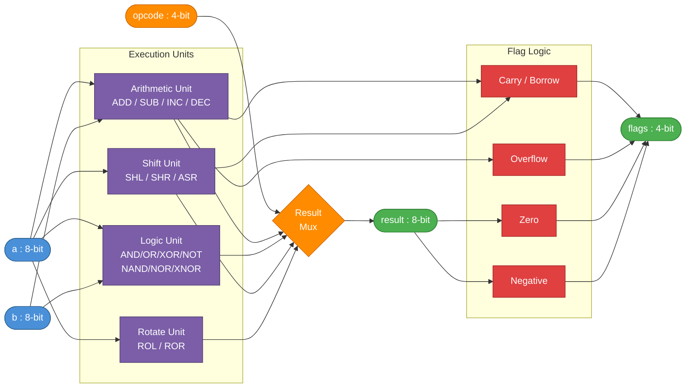
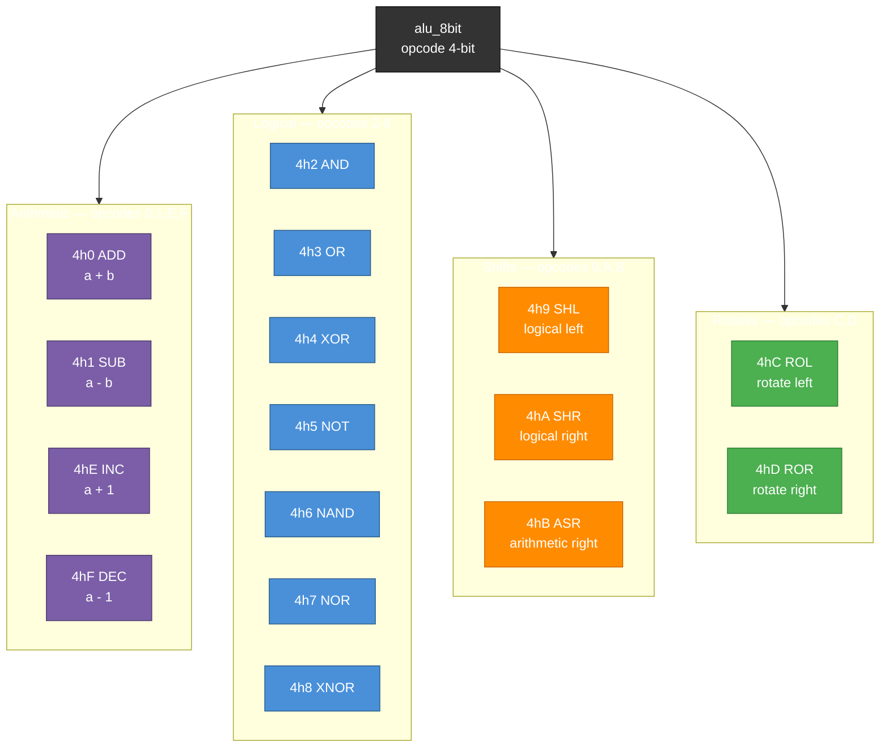

# ALU 8-Bit — Design Specification

**Document ID:** SPEC-ALU8-001
**Version:** 1.0
**Status:** Released
**Date:** 2025-04-19
**Source RTL:** `alu_8bit.sv`

---

## Table of Contents

1. [Introduction](#1-introduction)
2. [Feature Summary](#2-feature-summary)
3. [Functional Description](#3-functional-description)
4. [Interface Description](#4-interface-description)
5. [Parameterization Options](#5-parameterization-options)
6. [Opcode & Flag Reference](#6-opcode--flag-reference)
7. [Design Guidelines](#7-design-guidelines)
8. [Timing Diagrams](#8-timing-diagrams)

---

## 1. Introduction

The `alu_8bit` module is a fully combinational 8-bit Arithmetic Logic Unit (ALU) implemented in SystemVerilog. It supports 16 distinct operations across four categories: arithmetic, logical, shift, and rotate. The design is optimized for power efficiency and area through purely combinational logic — no sequential elements (flip-flops, registers, or latches) are present.

The ALU accepts two 8-bit operands (`a`, `b`), a 4-bit opcode, and produces an 8-bit result along with a packed 4-bit flag bus indicating arithmetic status conditions. It is designed for integration into processor datapaths, microcontrollers, and custom compute accelerators.

### 1.1 Key Highlights

- **Data Width:** 8-bit operands and result
- **Operations:** 16 operations via 4-bit opcode (4'h0 – 4'hF)
- **Combinational:** Zero clock/reset — no dynamic switching power from sequential elements
- **Flags:** 4-bit packed status bus `{carry, overflow, zero, negative}`
- **Synthesis-friendly:** `unique case` construct enables one-hot decode optimization

---

## 2. Feature Summary

### 2.1 Requirements Table

| REQ_ID  | Title                        | Type          | Acceptance Criteria                                              |
|---------|------------------------------|---------------|------------------------------------------------------------------|
| REQ_001 | 8-bit data width             | Functional    | Operands `a`, `b` and `result` are all 8 bits wide              |
| REQ_002 | 16 supported operations      | Functional    | All opcodes 4'h0–4'hF produce correct results per opcode table  |
| REQ_003 | Arithmetic operations        | Functional    | ADD, SUB, INC, DEC produce correct results with carry/overflow  |
| REQ_004 | Logical operations           | Functional    | AND, OR, XOR, NOT, NAND, NOR, XNOR produce correct bitwise result |
| REQ_005 | Shift operations             | Functional    | SHL, SHR, ASR correctly shift with carry capture                |
| REQ_006 | Rotate operations            | Functional    | ROL, ROR correctly rotate bits with wraparound                  |
| REQ_007 | Carry flag                   | Functional    | Carry set correctly for arithmetic overflow/shift out           |
| REQ_008 | Overflow flag                | Functional    | Signed overflow detected for ADD, SUB, INC, DEC                |
| REQ_009 | Zero flag                    | Functional    | Asserts when result == 8'h00                                    |
| REQ_010 | Negative flag                | Functional    | Reflects MSB (bit[7]) of result (two's complement sign bit)     |
| REQ_011 | Purely combinational         | Power         | No flip-flops or latches inferred — verified by synthesis report |
| REQ_012 | Latch-free implementation    | Quality       | Default assignments in `always_comb` prevent inferred latches   |
| REQ_013 | Synthesis-optimized decode   | Efficiency    | `unique case` used for opcode decode to enable synthesis opt    |
| REQ_014 | Shared arithmetic pre-compute | Efficiency  | Add/sub/inc/dec results are pre-computed and reused for flags   |

### 2.2 Ambiguity Log

| Q_ID  | Question                                     | Impact                          | Resolution / Default                              |
|-------|----------------------------------------------|---------------------------------|---------------------------------------------------|
| Q_001 | Is `b` operand used for shift/rotate amount? | Shift amount flexibility        | Shift is fixed at 1 bit; `b` is unused for shifts |
| Q_002 | Is the carry flag a borrow flag for SUB?     | Software convention             | Carry[8] of subtraction result used as borrow     |
| Q_003 | Is pipelining required?                      | Latency vs. power trade-off     | Purely combinational; no pipeline stage added     |

---

## 3. Functional Description

The `alu_8bit` module selects one of 16 operations based on the 4-bit `opcode` input and applies it combinationally to operands `a` and `b`. The result is available on `result[7:0]` with no pipeline delay. The 4-bit `flags` bus reflects the status of the most recent operation.

### 3.1 Hardware Architecture

The diagram below shows the top-level dataflow through the ALU: operands enter the execution units, the selected result propagates to the output, and the flag logic evaluates the result in parallel.

### 3.2 Operation Category Breakdown

### 3.3 Arithmetic Unit Detail

All arithmetic operations are pre-computed as 9-bit values to capture the carry/borrow bit:

| Signal        | Expression              | Purpose                          |
|---------------|-------------------------|----------------------------------|
| `add_result`  | `{1'b0, a} + {1'b0, b}` | ADD with carry capture at bit[8] |
| `sub_result`  | `{1'b0, a} - {1'b0, b}` | SUB with borrow capture at bit[8]|
| `inc_result`  | `{1'b0, a} + 9'd1`      | INC with carry capture           |
| `dec_result`  | `{1'b0, a} - 9'd1`      | DEC with borrow capture          |

These are driven by continuous `assign` statements, ensuring minimal logic replication.

### 3.4 Overflow Detection

Signed overflow is detected for ADD, SUB, INC, DEC operations using standard two's complement rules:

- **ADD overflow:** `(~a[7] & ~b[7] & result[7]) | (a[7] & b[7] & ~result[7])`
  - Positive + Positive = Negative → overflow
  - Negative + Negative = Positive → overflow
- **SUB overflow:** `(a[7] & ~b[7] & ~result[7]) | (~a[7] & b[7] & result[7])`
  - Positive - Negative = Negative → overflow
  - Negative - Positive = Positive → overflow
- **INC overflow:** `~a[7] & result[7]` (0x7F + 1 = 0x80)
- **DEC overflow:** `a[7] & ~result[7]` (0x80 - 1 = 0x7F)

### 3.5 Shift & Rotate Behavior

| Op  | Shift/Rotate Direction | Carry          | Fill Bit       |
|-----|------------------------|----------------|----------------|
| SHL | Left by 1              | `a[7]` (MSB)   | `0` into LSB   |
| SHR | Right by 1             | `a[0]` (LSB)   | `0` into MSB   |
| ASR | Right by 1 (signed)    | Not captured   | `a[7]` into MSB|
| ROL | Left rotate            | Not captured   | `a[7]` wraps to LSB |
| ROR | Right rotate           | Not captured   | `a[0]` wraps to MSB |

### 3.6 Flag Logic

Flags are evaluated combinationally from the final `result` and intermediate carry/overflow signals:

| Flag       | Bit | Expression                        | Description                            |
|------------|-----|-----------------------------------|----------------------------------------|
| `carry`    | [3] | Captured per-opcode               | Carry out / borrow / shift-out bit     |
| `overflow` | [2] | Signed overflow expression        | Signed result out of range             |
| `zero`     | [1] | `result == 8'h00`                 | Result is zero                         |
| `negative` | [0] | `result[7]`                       | MSB of result (two's complement sign)  |

For logical, rotate, and ASR operations, `carry` and `overflow` default to `0`.

